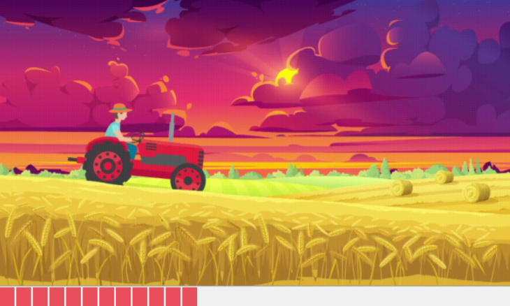
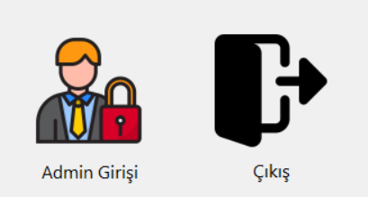
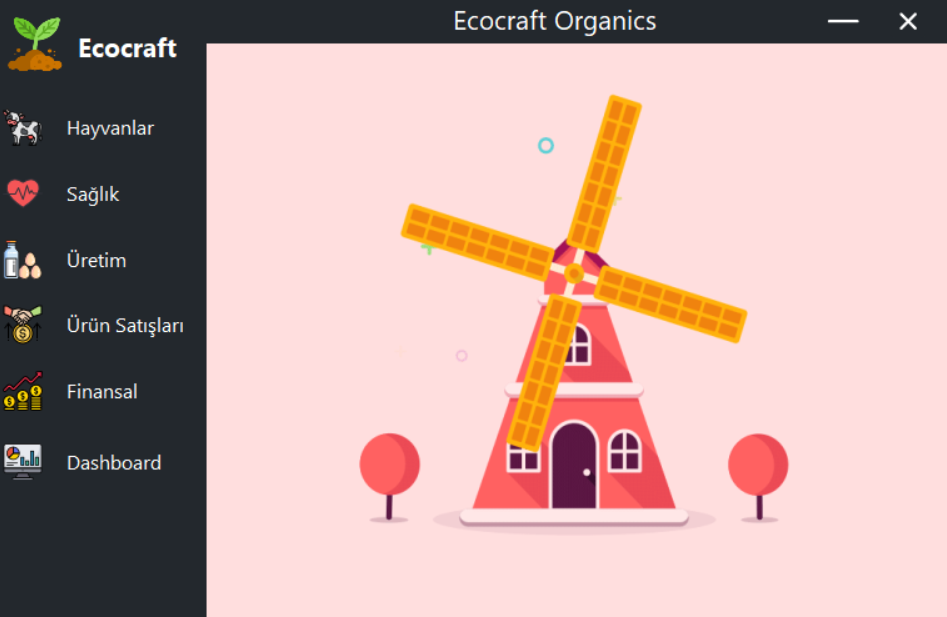

# Çiftlik Yönetim Projesi
## Genel Tanıtım

Bu proje bir çiftlikteki hayvanlar, ürünler ve diğer tüm kaynakların yönetimini gerçekleştirmeyi sağlayan bir masaüstü otomasyon projesidir. C# programlama dili ile windows forms teknolojisi yardımıyla geliştirilmiştir

# Uygulamanın Genel Taslağı
Uygulamamız sırasıyla yüklenme ekranı, ana menü, giriş, diğer panellere geçiş yapabileceğimiz genel bir ekran ve diğer ekranlar olmak üzere 10 adet ekrandan oluşmaktadır.

### Yükleme Ekranı

 Bu ekran, uygulama açılırken uygulama toparlanana kadar kullanıcının bir müddet beklemesini sağlayan bir ekrandır.Bu yönüyle projemize hem bir fonksiyonellik hem de tasarımsal olarak bir iyileştirme sunmaktadır. 

## Geçiş Ekranı

 Bu pencereden giriş paneline geçiş yapabiliriz ya da uygulamayı kapatabiliriz. 

## Giriş Ekranı

 Bu pencereden ilgili kullanıcı adı ve şifreyle giriş yapabilir ya da ana menüye dönebiliriz.Eğer kullanıcı bilgileri yanlış girilirse buna uygun bir uyarı verilecektir. 

## Ana Ekran 

 Bu ekran üzerinden diğer panellere geçiş yapabiliriz. 

## Hayvanlar Paneli

 Bu pencereden hayvanlarla ilgili listeleme, ekleme,silme,güncelleme işlemlerini gerçekleştirebiliriz. 

## Sağlık Paneli

 Bu pencereden hayvanların sağlık durumu ile ilgili listeleme, ekleme,silme,güncelleme işlemlerini gerçekleştirebiliriz.  

## Üretim Paneli

 Bu pencereden hayvanların sağladığı ürünlerle ilgili listeleme, ekleme,silme,güncelleme işlemlerini gerçekleştirebiliriz.  

## Ürün Satışları Paneli

 Bu pencereden ürün satışları ile ilgili listeleme, ekleme,silme,güncelleme işlemlerini gerçekleştirebiliriz.  

## Finansal Yönetim Paneli

 Bu pencereden finans kaynakları ilgili listeleme, ekleme,silme,güncelleme işlemlerini gerçekleştirebilir ve finansal yönetimimizi gerçekleştirebiliriz.

## Dashboard

 Bu pencereden çiftlikle ilgili en önemli genel istatistikleri edinebiliriz.

